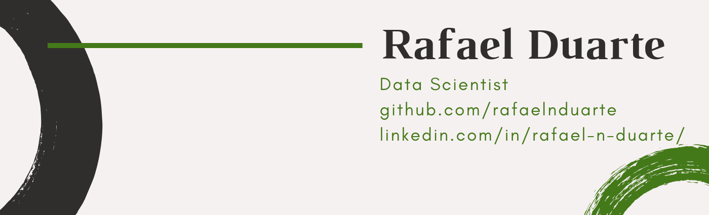

   

# Spotify_K-Means_Clustering

According to their own website, [Spotify](https://www.spotify.com) is a digital music, podcast, and video streaming service that gives you access to millions of songs and other content from artists all over the world.

  

Being an avid Spotify user myself, there's one feature I think is lacking. I like to call it **Mood Playlist**, which would be some kind of *Biased Random* mode.

Whenever you're listening to your saved songs and you want to shake things up a little, it's a great idea to turn on Random mode. It really is random, and sometimes that's really what you want.

However, sometimes you just want to **set the mood** for the songs to be played. That's exactly what this feature would do. You select a song, hit the mode, and Spotify queues up the most related songs, in order to keep up with your mood.

Imagine you're on a dinner date and want to listen to those romantic songs you have saved. Of course, you haven't prepared a playlist beforehand. All you have to do is select "The way you look tonight", switch **Mood Playlist** on, and it will play all of those songs that are similar to the first one you selected.

> The goal of this project is to explore the data, understand the correlations, and come up with an algorithm that would serve as the basis for the creation of the **Mood Playlist** feature.

To do that, we'll be using a dataset obtained by me using the [Spotify API](https://developer.spotify.com/). A notebook on the process to get the data from Spotify using the Python Library [Spotipy](https://spotipy.readthedocs.io/en/latest/) can be found [here](https://colab.research.google.com/drive/1-c-F9BTy2W2PkuArX0S4Rbp_kNhwB8rI).

Also, kudos to [tomigelo](https://www.kaggle.com/tomigelo/spotify-audio-features), for coming up with the code I used to retrieve the data from Spotify.

  

